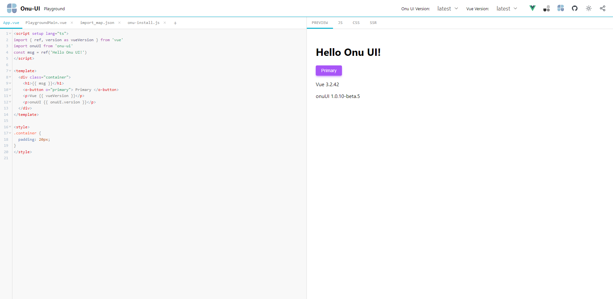

# Onu UI playground

## ❗ notice

> - Since `onu-ui` is currently unstable, some components and styles may have problems in the playground
> 
> - Will be migrated to `onu-ui` for maintenance at some time in the future

## 🎉supports

- vue3
- options and setup api
- typescript
- auto import onu ui
- code prettier

> ‼️ onu-ui version support >= 1.10.0

## 💥 relate project

- 🥝 [vue3](https://staging-cn.vuejs.org/)
- 🥑 [unocss](https://github.com/unocss/unocss)
- 🌸 [onu-ui](https://onu.zyob.top/)

## 🙇‍ thanks

- [@vue/repl](https://github.com/vuejs/repl)
- [vue-use](https://github.com/vueuse/vueuse)
- [element-plus-playground](https://github.com/element-plus/element-plus-playground)
